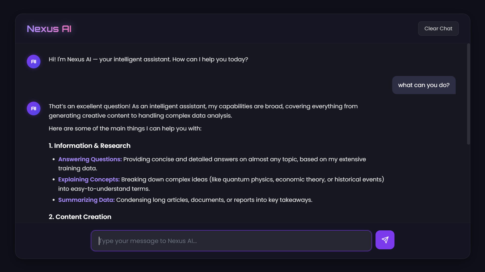

# **NEXUS AI — Intelligent Web Chatbot**
**Task 3 – CODTECH Internship | AI Chatbot with NLP**
### **COMPANY:** CODTECH IT SOLUTIONS  
### **NAME:** AMAAN SHAIKH  
### **INTERN ID:** CT06DR1460 
### **DOMAIN:** Python Programming  
### **DURATION:** 6 Weeks  
### **MENTOR:** Neela Santhosh Kumar  

---

Nexus AI is a modern, web-based intelligent chatbot built using **Flask**, **Google Gemini API**, and **NLP techniques**. It provides a clean, responsive interface for chatting with AI in real time. This project was developed as part of **Task 3 – AI Chatbot with NLP** under the CODTECH Internship program.

---

## 🚀 **Project Overview**

Nexus AI is designed to simulate human-like conversations through a simple and elegant interface.  
It processes user messages, sends them to Google Gemini, receives AI-generated responses, and displays them instantly.

This project helped me apply:

- Natural Language Processing (NLP)
- Python backend development
- API Integration
- HTML, CSS & JavaScript
- Flask routing and templates
- Session-based conversation handling

It fulfills the requirements of CODTECH **Task 3 – AI Chatbot with NLP**.

---

## 🔧 **Tools & Technologies Used**

### **Backend**
- Python 3  
- Flask  
- Google Gemini API  
- python-dotenv  

### **Frontend**
- HTML5  
- CSS3 (custom UI in `style.css`)  
- JavaScript  

### **Utilities**
- `google-generativeai`
- `list_models.py`
- `.env` file for secure key management
- `Procfile` for server deployment

---

## ✨ **Features**

- ⚡ Real-time chat with Nexus AI  
- 💬 Session-based chat history  
- 🎨 Modern, responsive UI  
- 🔁 Clear chat option  
- 🔧 Configurable AI model  
- 📜 Model listing script  
- 🧠 NLP-supported message processing  

## 🛠 **Installation & Setup**

### **1️⃣ Clone the project**
git clone https://github.com/amaanshaikh711/Nexus-AI-Chatbot.git
cd Nexus-AI-Chatbot

### **2️⃣ Install Dependencies **
pip install -r requirements.txt

### **3️⃣ Run the Flask Application**
python app.py

### **4️⃣ Open The Browser**
http://127.0.0.1:5000

